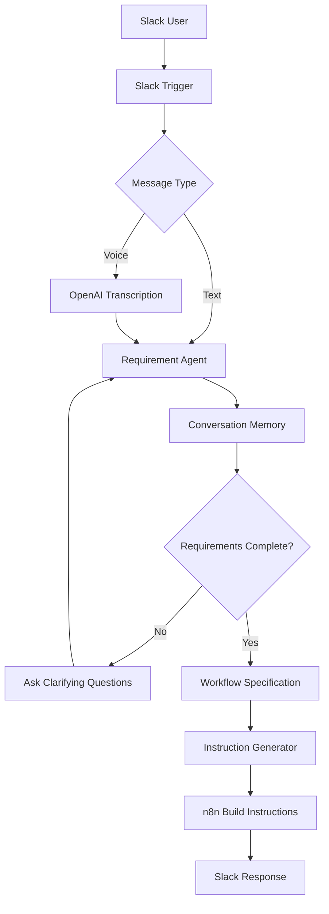

# 🤖 Slack AI Agent Builder

<p align="center">
  
  
  
  
</p>

<p align="center">
  <strong>Turn simple Slack conversations into complete AI workflow blueprints.</strong>
</p>

<p align="center">
  Design → Clarify → Validate → Generate → Build
</p>

---

## 🌟 What is this?

Building AI agents usually requires:

❌ Understanding APIs

❌ Learning workflow automation

❌ Designing architecture

❌ Writing prompts

❌ Connecting integrations

This project removes all of that.

Simply describe what you want inside Slack and the assistant will:

- Ask intelligent follow-up questions
- Understand your requirements
- Generate a complete workflow specification
- Create implementation instructions for n8n
- Support both text and voice interactions

Think of it as a **Solution Architect for AI Automation inside Slack.**

---

## 🎬 Demo Flow

User:

```text
@workflow-bot Build an AI assistant that reads Gmail emails
and creates tasks in Notion.
```

Bot:

```text
Which inbox should be monitored?

Should duplicate tasks be ignored?

How should task priority be determined?
```

Bot generates:

```yaml
Goal:
  Convert Gmail emails into Notion tasks

Trigger:
  New Gmail Email

Actions:
  Extract Action Items
  Create Notion Task

Error Handling:
  Ignore Duplicates
```

Final Output:

```text
Step-by-step n8n workflow instructions ready for implementation.
```

---

## 🏗️ System Architecture



---

## ✨ Features

### 🤖 Requirement Discovery

Automatically discovers:

- Goals
- Triggers
- Inputs
- Outputs
- Integrations
- Business Rules

---

### 🧠 Conversation Memory

Maintains context across the entire discussion.

---

### 🎙️ Voice Notes

Supports Slack audio messages using OpenAI transcription.

---

### ⚡ Multi-Agent Workflow

Requirement Agent

↓

Specification Generator

↓

Instruction Generator

---

### 🛠 n8n Ready Output

Produces implementation-ready instructions instead of generic AI responses.

---

## 🔥 Tech Stack

| Technology | Purpose |
|------------|----------|
| n8n | Workflow Engine |
| Slack | User Interface |
| OpenAI | Speech Processing |
| Groq | Requirement Analysis |
| Llama 3.3 70B | Reasoning |
| AI Agents | Workflow Generation |

---

## 📦 Installation

### Clone Repository

```bash
git clone https://github.com/yourusername/slack-ai-agent-builder.git
cd slack-ai-agent-builder
```

### Import Workflow

1. Open n8n
2. Import workflow JSON
3. Configure credentials
4. Activate workflow

---

## 🔐 Required Credentials

### Slack

```text
app_mentions:read
chat:write
channels:history
```

### OpenAI

```text
Audio Transcription
Voice Processing
```

### Groq

```text
Requirement Analysis
Instruction Generation
```

---

## 🚀 Future Improvements

- [ ] Workflow JSON Export
- [ ] Workflow Diagram Generation
- [ ] Supabase Memory
- [ ] Human Approval Layer
- [ ] Multi-Language Support
- [ ] Tool Calling Support
- [ ] Auto Workflow Deployment

---

## 👨‍💻 Author

### Raunaq Adlakha

Full Stack Developer • AI Builder • Founder of SparkEdge Innovations

Building AI systems, automation platforms and intelligent workflows.

---

<p align="center">
⭐ Star this repository if you found it useful.
</p>
